# NLP Analysis of Yahoo Questions for Content Tagging
Content tagging or text classification is the task of assigning a set of pre-defined categories. Content Tagging can be used to organize, structure, and categorize texts and documents.
In fact, we use content tagging in our daily activites such as when we are using search engines, searching through Amazon website, or when we are using social media such as Facebook and Instagram.
In this project, we decided to work on Yahoo dataset and categorize the questions into one of the 10 categories that have been defined by Yahoo.

## EDA Analysis
As mentioned in the previous part, the Yahoo Answer! dataset has been used in this work. This dataset can be downloaded from the following link:
https://course.fast.ai/datasets

I selected 140,000 documents from each category, total of 1,400,000 documents. Hence, we made sure to have a balanced dataset for this project. As can be seen in the following figure, Yahoo has classified the questions into 10 groups including:
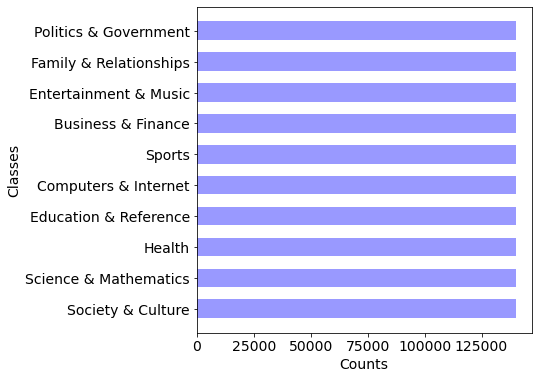
*   Politics & Government
*   Family and Relationships
*   Entertainment & Music
*   Business & Finance
*   Sports
*   Computers & Internet
*   Education & Reference
*   Health
*   Science & Mathematics
*   Society & Culture

## Data Insights
In this section, sentiment analysis is performed on the questions and answers to interpret the mood and emotions of the users. In order to perform sentiment analysis, I used TextBlob which is a python library for Natural Language Processing (NLP).
TextBlob uses a pre-defined dictionary classifying negative and positive words. In this process, a text messsage will be represented by bag of words. After assigning individual scores to all the words, final sentiment is calculated by some pooling operation like taking average of all the sentiments. 
The polarity can vary between -1 and 1, where -1 means a negative sentiment, +1 means a positive sentiment, and 0 means neutral. 
Subjectivity also quantifies the amount of personal opinion and factual information. Subjectivity is within the range of 0 and 1. Subjectivity of 1 means the text contains personal opinion rather than factual information. Textblob calculates subjectivity by looking at the intensity (i.e., adverbs).

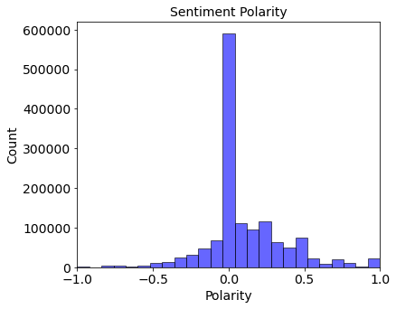
This figure shows the histogram of sentiment polarity for the 1.4 million questions on Yahoo Answer website. As can be seen, the sentiment is mainly distributed around 0 which indicates that in general, the questions have neutral sentiments. In other words, users ask questions in neutral way.

 In addition, we plotted the subjectivity vs. polarity for each category by averaging the polaity and subjectivity for each  group. In general, the mean subjectivity varies between 0.28 and 0.42 which means there is some kind of bias or personal opinion in the questions. "Family and Relationship" category seems to have the highest subjectivity which means user have higher bias in that category when asking questions compared to the other categories. Meanwhile, "Science and Mathematics" has the lowest subjectivity. 
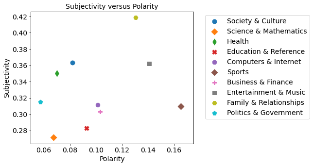

## Modeling
The following figure shows the implemented workflow in this work. 
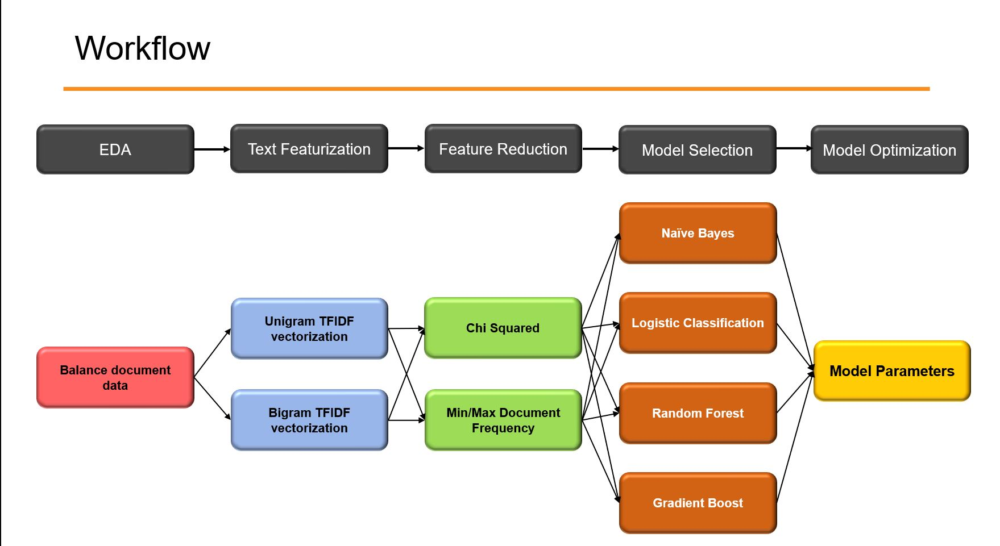

First, we started with EDA to find meaningful insights from the data (i.e., questions and answers) and we  used 140,000 questions and answer from each category. 
In the next step, we performed text featurization. In other words, we tokezined the document, removed punctuations and stop words, performed stemming, and lemmatization. Finally, we used unigram and bigram TFIDF vectorization to get the required features.
Since we ended up with too many features at this step, we used feature reduction techniques to reduce the number of features. Therefore, Chi squared and Min/Max document frequency techniques were used to reduce the number of features.
Then, we splitted our data into training and test set with ratio of 90:10. Four different classification models were used in this work including: 
*   Naive Bayes
*   Logistic Classification
*   Random Forest
*   Gradient Boost.
Afterward, we performed hyperparameter tuning using Gridsearching and cross validation to find the optimum parameters. Then. we applied the tuned model to the testing dataset.

## ML Model
The following table presents the accuracy score achieved by the four different classification models. As can be seen, logistic classification achieved highest score of 0.72. I have to mention there is a publication from Yahoo on this dataset with accuracy score of 0.68. Hence, logistic classification is performing relatively well on this dataset.

| Model Name  |  Accuracy Score |
| -- | -- |
|  Logistic Classification  |  0.72  |
|  Gradient Boost  |  0.68  |
|  Random Forest  |  0.66  |
|  Naive Bayes  |  0.65  |

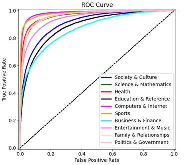
The following figure shows the ROC curve for all the different categories. The y-axis is true positive rate and x-axis is false positive rate. As can be seen, the model is having a good performance for most categories except "Business & Finance" and "Education & Reference".
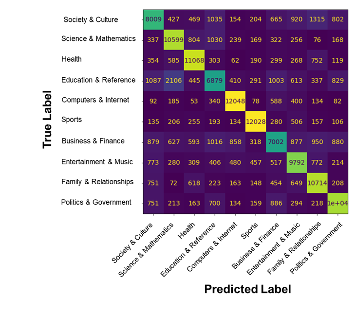
Confusion matrix also shows the same behavior as we have relatively lower true positives (main diagonal) for these two specific categories compared to the others. We looked at this misclassification in more details in the "Model Review" section.

|      Sports        |       Politics        |
|       --           |         --            |
|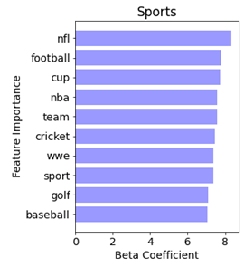 | 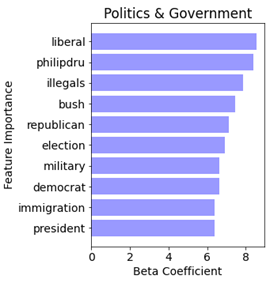 | 
|      Health        |       Business        |
|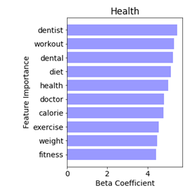 |  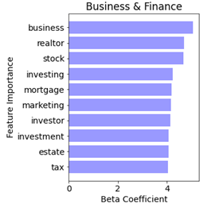| 

## Model Review
In this section, I looked at my model in more details to figure out why it has misclassified some questions, especially "Business & Finance" and "Education" categories. After detailed analysis, I found two main reasons for misclassification: 1) mislabeling the tags by Yahoo 2) complicated sentence structure. The following section explains about these items in more details:

### Mislabeling by Yahoo!

The following part shows some questions that Yahoo tagged as "Business and Finance" but apparently they are not related to that category. I also shows how our model is picking up the word and predicts the probability of each category.

*   **Question 1**: For 6 months, I have received this error,"a required DLL file, YIMAGE", was not found. Can you help me please
*   **Answer 1**: delete yahoo messenger completly and make sure there nothing left in the and redownload it.
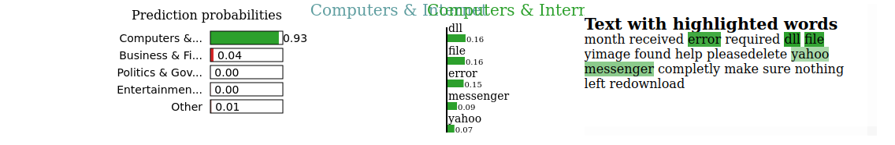

*   **Question 2**: why do i feel left out? all the time?
*   **Answer 2**: Probably the same reason I do. I have a hard time being out 
going. But you can work on it. Just asert yourself, people WANT 
to be around you trust me I know.
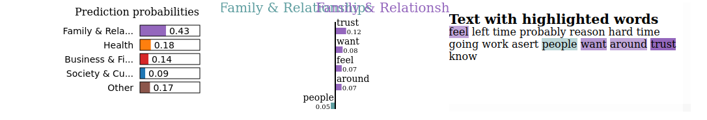

*   **Question 3**: which is the largest palace in the world?
*   **Answer 3**: Largest residential palace is the Istana Nurul Iman. This is where the Sultan of Brunei lives. 2,152,782 square feet.The Forbidden City in Beijing is the biggest Palace Complex and used to be the home of the Chinese Emperors before the revolution and is 7,750,000 squre feet in size.'
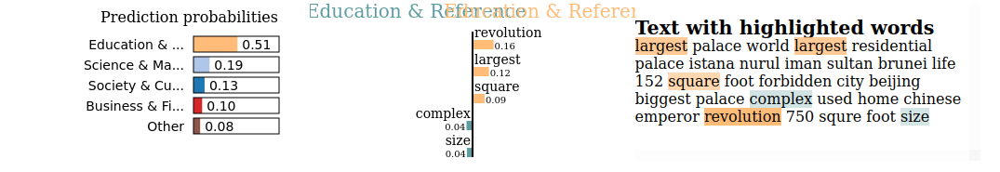

### Complicated Sentence Structure

*   **Question 1**: how could you distunguish a plant cell from an animal cell when looking in a microscope?4 my bio lab final...help! thanks!
*   **Answer 1**: animal cells don't have a cell wall
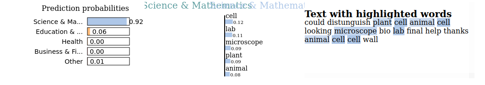

*   **Question 2**: what is the difference between coca-cola classic and coca-cola?
*   **Answer 2**: Coca-Cola is the default name for the beverage. Coca-Cola Classic is a more recent name used in comparison with New Coke, which failed miserably.
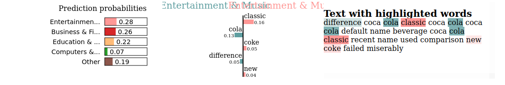

## Towards a Better Model
In the future, I plan to continue on this project as mentioned below:

*   Build a Long Short Term Memory (LSTM) deep learning model and try feature engineering by transforming
the corpus into a list of sequences using Word2Vec model

*   Apply transfer learning model to the corpus using Google's BERT module (Bidirectional Encoder Representations from Transformers)

## Acknowledgments
I greatly appreciate Galvanize instructors, Juliana Duncan and Dan Rupp, for their valuable comments during this project.