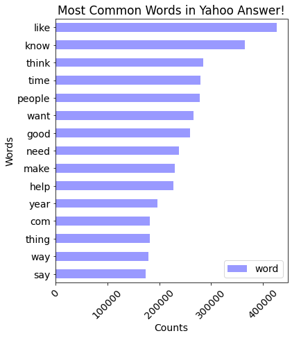
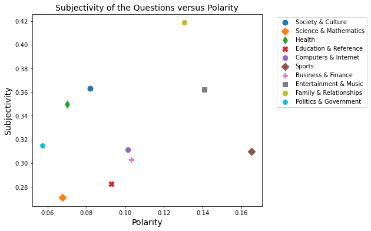
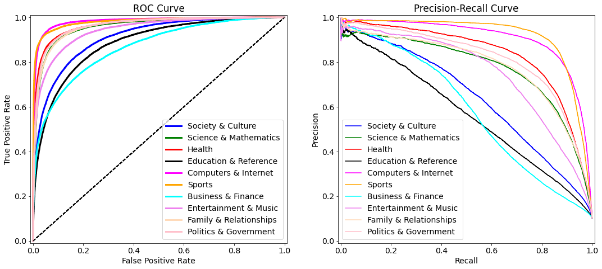
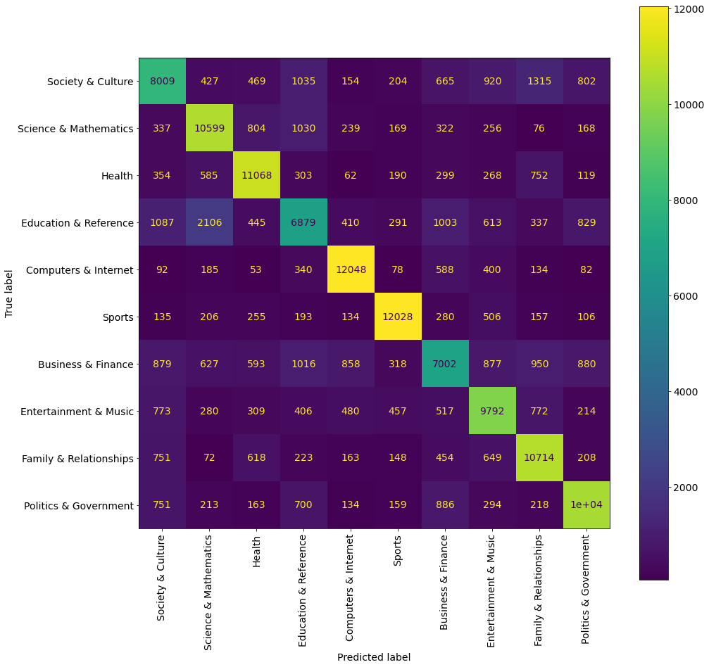
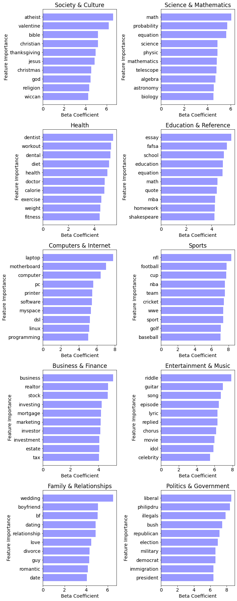

# NLP Analysis of Yahoo Questions for Tagging Application

## EDA Analysis
The dataset can be downloaded from this link:
https://course.fast.ai/datasets

## Data Insights

## Modeling

## ML Model

| Model Name  |  Accuracy Score |
| -- | -- |
|  Logistic Classification  |  0.72  |
|  Gradient Boost  |  0.68  |
|  Random Forest  |  0.66  |
|  Naive Bayes  |  0.65  |

## Model Review
fdssfg
gfdgdff
### 1. Mislabeling by Yahoo!
*   fds
*   *fdsf

### 2. Complicated Structure/sentence

Question:
Answer  : 

## Towards a Better Model
In the future, I plan to work on the following two projects:

* Build a Long Short Term Memory (LSTM) deep learning model and try feature engineering by transforming
the corpus into a list of sequences using Word2Vec model

* Apply transfer learning model to the corpus using Google's BERT module (Bidirectional Encoder Representations from Transformers)

## Acknowledgments
I greatly appreciate Galvanize instructors, Juliana Duncan and Dan Rupp, for their valuable comments during this project.